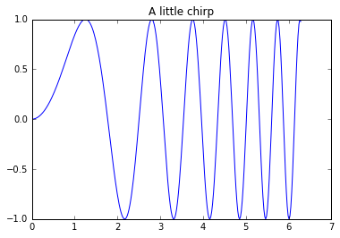

# IPython 笔记与练习

## 学习资源
[IPython官网](http://ipython.org)  
[Stackoverflow, tag it "ipython"](http://stackoverflow.com/questions/tagged/ipython)  
[Notebook Gallery](http://nb.bianp.net/sort/views/)

## 常用快捷键整理
* 查看快捷键清单：Ctrl + M + H （先同时按住 Ctrl + m ，再按 h ）
* cell 切换成 code 模式：Y 
* cell 切换成 markdown 模式：M
* 删除 cell：X
* 撤销 cell 的删除：Z
* 复制 cell：C
* 上方添加 cell：A
* 下方添加 cell：B
* 下方黏贴 cell：V
* 上方粘贴 cell：Shift + V
* 运行 cell：Ctrl + Return
* 运行 cell 并打开一个新 cell：Shift + Return
* 撤销上一步：Command + Z
* 保存：Command + S

## 代码运行
在cell 中输入代码后，点击“run cell”（图标如下所示），或快捷键 Shift + Return／Ctrl + Return  


```python
print ("Hellot world!")
```

    Hellot world!


## 帮助

变量前或后加上问号（?）可以显示有关该对象的通用信息


```python
import numpy as np
```


```python
?np
```

如果该对象是一个函数或实例，则其docstring（如果有的话）会被显示出来：


```python
def add_numbers(a, b):
    return a + b
```


```python
?add_numbers
```


双问号（??）:显示出该函数的源代码（如果有的话）：


```python
??add_numbers
```


搜索IPython 命名空间：问号（?）与通配符（*）配合，可显示出所有与该通配符表达匹配的名称，列出所有相关函数。  
注：前面已执行过“import numpy as np”，否则，无反应


```python
np.*load*?
```


快速参考手册（Quick Reference Card）：


```python
%quickref
```

##  Tab 键自动补全

输入表达式时，按下Tab键，命名空间中任何与已输入字符串相匹配的变量都会被找出。


```python
b = [1, 2, 3]
```


```python
b.
```


## 输入与输出

最近的输出变量：_ （一个下划线）  
倒数第二的输出变量：__ （两个下划线）


```python
2 + 10
```


    12


```python
_ + 10
```


    22


```python
__ + 10
```


    22


X 行的输出变量：_X ／ Out[X]  
X 行的输入变量：_iX / In[X]


```python
foo = 'bar'
```


```python
foo
```


    'bar'


```python
_14
```


    'bar'


```python
_i14
```


    'foo'


```python
Out[16]
```


    'foo'


```python
In[17]
```


    'Out[16]'


抑制输出，抑制之后没有输出：;


```python
10 + 20;
```


```python
_
```


    'Out[16]'


查看历史记录（输入）：%history


```python
%history
```

    print ("Hellot world!")
    import numpy as np
    ?np
    def add_numbers(a, b):
        return a + b
    ?add_numbers
    ??add_numbers
    np.*load*?
    %quickref
    b = [1, 2, 3]
    2 + 10
    _ + 10
    __ + 10
    foo = 'bar'
    foo
    _14
    _i14
    Out[16]
    In[22]
    In[17]
    10 + 20;
    _
    %history


输入集合：In


```python
In
```


    ['',
     'print ("Hellot world!")',
     'import numpy as np',
     "get_ipython().magic('pinfo np')",
     'def add_numbers(a, b):\n    return a + b',
     "get_ipython().magic('pinfo add_numbers')",
     "get_ipython().magic('pinfo2 add_numbers')",
     "get_ipython().magic('psearch np.*load*')",
     "get_ipython().magic('quickref')",
     'b = [1, 2, 3]',
     '2 + 10',
     '_ + 10',
     '__ + 10',
     "foo = 'bar'",
     'foo',
     '_14',
     '_i14',
     'Out[16]',
     'In[22]',
     'In[17]',
     '10 + 20;',
     '_',
     "get_ipython().magic('history')",
     'In']


输出集合：Out


```python
Out
```


    {10: 12,
     11: 22,
     12: 22,
     14: 'bar',
     15: 'bar',
     16: 'foo',
     17: 'foo',
     19: 'Out[16]',
     21: 'Out[16]',
     23: ['',
      'print ("Hellot world!")',
      'import numpy as np',
      "get_ipython().magic('pinfo np')",
      'def add_numbers(a, b):\n    return a + b',
      "get_ipython().magic('pinfo add_numbers')",
      "get_ipython().magic('pinfo2 add_numbers')",
      "get_ipython().magic('psearch np.*load*')",
      "get_ipython().magic('quickref')",
      'b = [1, 2, 3]',
      '2 + 10',
      '_ + 10',
      '__ + 10',
      "foo = 'bar'",
      'foo',
      '_14',
      '_i14',
      'Out[16]',
      'In[22]',
      'In[17]',
      '10 + 20;',
      '_',
      "get_ipython().magic('history')",
      'In',
      'Out']}


## 与操作系统交互

跟系统相关的常用命令：  

|命令|说明|
|---|---|
|!pwd|查看当前位置|
|%cd _directory_|更改位置到directory|
|!ls|查看当前目录|
|%bookmark|制作目录书签|
|%bookmark -1|列出所有书签|


```python
!pwd
```

    /Users/lixin/Documents/Data103


```python
%cd assignment
```

    /Users/lixin/Documents/Data103/assignment


```python
files = !ls
print ("My current directory's files:")
print (files)
```

    My current directory's files:
    ['0w', '1w', '2w', '3w', '4w', '5w', '6w', '7w', '8w', '9w', 'README.md']


```python
foo = "*w"
!ls $foo
```

    0w:
    0w-homework-ollie.md
    README.md
    ec.png
    ec－time.png
    interaction-mfsd.png
    interaction-mftc.png
    interaction.png
    lgbt－ae.png
    lgbt－be.png
    lgbt－china.png
    lgbt－e.png
    sp－sample.png
    中国统计年鉴2014城乡居民人均收入及恩格尔系数.xls
    
    1w:
    **?.png      ?.png        ??.png       README.md    run_cell.png tab.png
    
    2w:
    README.md
    
    3w:
    README.md
    
    4w:
    README.md
    
    5w:
    README.md
    
    6w:
    README.md
    
    7w:
    README.md
    
    8w:
    README.md
    
    9w:
    README.md


```python
%bookmark data /Users/lixin/Documents/Data103
```


```python
%cd data
```

    (bookmark:data) -> /Users/lixin/Documents/Data103
    /Users/lixin/Documents/Data103


```python
%bookmark -l
```

    Current bookmarks:
    data -> /Users/lixin/Documents/Data103


## 魔法命令

常用魔法命令：

|命令|说明|
|---|---|
|%quickref|显示IPython的快速参考|
|%magic|显示所有魔法命令的详细文档|
|%lsmagic|罗列所有魔法命令|
|%time|执行一行代码一次，显示执行时间|
|%timeit|多次执行一行代码，以计算系统平均执行时间|
|%%timeit|多次执行cell内代码，以计算系统平均执行时间|
|%%bash|在cell内打开bash|
|%%file x.x|cell内容写入文件x.x中|
|%run _script.py_|在IPython中执行一个python脚本文件|


```python
%magic
```


```python
%lsmagic
```


    Available line magics:
    %alias  %alias_magic  %autocall  %automagic  %autosave  %bookmark  %cat  %cd  %clear  %colors  %config  %connect_info  %cp  %debug  %dhist  %dirs  %doctest_mode  %ed  %edit  %env  %gui  %hist  %history  %install_default_config  %install_ext  %install_profiles  %killbgscripts  %ldir  %less  %lf  %lk  %ll  %load  %load_ext  %loadpy  %logoff  %logon  %logstart  %logstate  %logstop  %ls  %lsmagic  %lx  %macro  %magic  %man  %matplotlib  %mkdir  %more  %mv  %notebook  %page  %pastebin  %pdb  %pdef  %pdoc  %pfile  %pinfo  %pinfo2  %popd  %pprint  %precision  %profile  %prun  %psearch  %psource  %pushd  %pwd  %pycat  %pylab  %qtconsole  %quickref  %recall  %rehashx  %reload_ext  %rep  %rerun  %reset  %reset_selective  %rm  %rmdir  %run  %save  %sc  %set_env  %store  %sx  %system  %tb  %time  %timeit  %unalias  %unload_ext  %who  %who_ls  %whos  %xdel  %xmode
    
    Available cell magics:
    %%!  %%HTML  %%SVG  %%bash  %%capture  %%debug  %%file  %%html  %%javascript  %%latex  %%perl  %%prun  %%pypy  %%python  %%python2  %%python3  %%ruby  %%script  %%sh  %%svg  %%sx  %%system  %%time  %%timeit  %%writefile
    
    Automagic is ON, % prefix IS NOT needed for line magics.


```python
%time range(100)
```

    CPU times: user 5 µs, sys: 0 ns, total: 5 µs
    Wall time: 10 µs


    range(0, 100)


```python
%timeit range(100)
```

    The slowest run took 15.53 times longer than the fastest. This could mean that an intermediate result is being cached.
    1000000 loops, best of 3: 351 ns per loop


```python
%%timeit
range (10)
range (100)
```

    1000000 loops, best of 3: 694 ns per loop


```python
%%bash
pwd
ls
```

    /Users/lixin/Documents/Data103
    ISSUE_TEMPLATE.md
    README.md
    assignment
    assignment_sample_answer
    code
    note


```python
%%file text.py
print ("World")
```

    Writing text.py


```python
%run text.py
```

    World


## 绘图表示数据的走向

调用matplotlib


```python
%matplotlib inline
```


    ---------------------------------------------------------------------------

    ValueError                                Traceback (most recent call last)

    <ipython-input-54-e27d371d6baa> in <module>()
    ----> 1 get_ipython().magic('matplotlib inline')
    

    /Users/lixin/anaconda/lib/python3.5/site-packages/IPython/core/interactiveshell.py in magic(self, arg_s)
       2161         magic_name, _, magic_arg_s = arg_s.partition(' ')
       2162         magic_name = magic_name.lstrip(prefilter.ESC_MAGIC)
    -> 2163         return self.run_line_magic(magic_name, magic_arg_s)
       2164 
       2165     #-------------------------------------------------------------------------


    /Users/lixin/anaconda/lib/python3.5/site-packages/IPython/core/interactiveshell.py in run_line_magic(self, magic_name, line)
       2082                 kwargs['local_ns'] = sys._getframe(stack_depth).f_locals
       2083             with self.builtin_trap:
    -> 2084                 result = fn(*args,**kwargs)
       2085             return result
       2086 


    <decorator-gen-106> in matplotlib(self, line)


    /Users/lixin/anaconda/lib/python3.5/site-packages/IPython/core/magic.py in <lambda>(f, *a, **k)
        191     # but it's overkill for just that one bit of state.
        192     def magic_deco(arg):
    --> 193         call = lambda f, *a, **k: f(*a, **k)
        194 
        195         if callable(arg):


    /Users/lixin/anaconda/lib/python3.5/site-packages/IPython/core/magics/pylab.py in matplotlib(self, line)
         98             print("Available matplotlib backends: %s" % backends_list)
         99         else:
    --> 100             gui, backend = self.shell.enable_matplotlib(args.gui)
        101             self._show_matplotlib_backend(args.gui, backend)
        102 


    /Users/lixin/anaconda/lib/python3.5/site-packages/IPython/core/interactiveshell.py in enable_matplotlib(self, gui)
       2937         """
       2938         from IPython.core import pylabtools as pt
    -> 2939         gui, backend = pt.find_gui_and_backend(gui, self.pylab_gui_select)
       2940 
       2941         if gui != 'inline':


    /Users/lixin/anaconda/lib/python3.5/site-packages/IPython/core/pylabtools.py in find_gui_and_backend(gui, gui_select)
        258     """
        259 
    --> 260     import matplotlib
        261 
        262     if gui and gui != 'auto':


    /Users/lixin/anaconda/lib/python3.5/site-packages/matplotlib/__init__.py in <module>()
       1129 
       1130 # this is the instance used by the matplotlib classes
    -> 1131 rcParams = rc_params()
       1132 
       1133 if rcParams['examples.directory']:


    /Users/lixin/anaconda/lib/python3.5/site-packages/matplotlib/__init__.py in rc_params(fail_on_error)
        973         return ret
        974 
    --> 975     return rc_params_from_file(fname, fail_on_error)
        976 
        977 


    /Users/lixin/anaconda/lib/python3.5/site-packages/matplotlib/__init__.py in rc_params_from_file(fname, fail_on_error, use_default_template)
       1098         parameters specified in the file. (Useful for updating dicts.)
       1099     """
    -> 1100     config_from_file = _rc_params_in_file(fname, fail_on_error)
       1101 
       1102     if not use_default_template:


    /Users/lixin/anaconda/lib/python3.5/site-packages/matplotlib/__init__.py in _rc_params_in_file(fname, fail_on_error)
       1016     cnt = 0
       1017     rc_temp = {}
    -> 1018     with _open_file_or_url(fname) as fd:
       1019         try:
       1020             for line in fd:


    /Users/lixin/anaconda/lib/python3.5/contextlib.py in __enter__(self)
         57     def __enter__(self):
         58         try:
    ---> 59             return next(self.gen)
         60         except StopIteration:
         61             raise RuntimeError("generator didn't yield") from None


    /Users/lixin/anaconda/lib/python3.5/site-packages/matplotlib/__init__.py in _open_file_or_url(fname)
        998     else:
        999         fname = os.path.expanduser(fname)
    -> 1000         encoding = locale.getdefaultlocale()[1]
       1001         if encoding is None:
       1002             encoding = "utf-8"


    /Users/lixin/anaconda/lib/python3.5/locale.py in getdefaultlocale(envvars)
        556     else:
        557         localename = 'C'
    --> 558     return _parse_localename(localename)
        559 
        560 


    /Users/lixin/anaconda/lib/python3.5/locale.py in _parse_localename(localename)
        484     elif code == 'C':
        485         return None, None
    --> 486     raise ValueError('unknown locale: %s' % localename)
        487 
        488 def _build_localename(localetuple):


    ValueError: unknown locale: UTF-8


出现错误  
> ValueError: unknown locale: UTF-8

尝试在stackoverflow搜索错误名称，找到[解决方案](http://stackoverflow.com/questions/19961239/pelican-3-3-pelican-quickstart-error-valueerror-unknown-locale-utf-8)，是.bash_profile 需要更新。  
[.bash_profile的更新方法](http://www.cnblogs.com/mokey/p/3542389.html)


```python
%matplotlib inline
```


```python
import numpy as np
import matplotlib.pyplot as plt
from matplotlib.pyplot import gcf
```


```python
x = np.linspace(0, 2*np.pi, 300)
y = np.sin(x**2)
plt.plot(x, y)
plt.title("A little chirp")
f = gcf() 
```





## 数学公式输入

IPython 使用MathJax 引擎渲染数学符号的输出。IPython 中的Cell 可以在Markdown 模式下直接使用 LaTex 语法输出数学公式。

公式的几种输出方式：  

|命令|说明|
|---|---|
|```$数学公式$```|公式在行中显示|
|```$$数学公式$$```|公式独占一行显示|
|```\begin{equation}数学公式\end{equation}```|公式独占一行显示|
|```\begin{equation*}数学公式\end{equation*}```|公式独占一行显示|

```$10^{10}$```

$10^{10}$

```$$10^{10}$$```

$$10^{10}$$

```\begin{equation}10^{10}\end{equation}```

\begin{equation}10^{10}\end{equation}

```\begin{equation*}10^{10}\end{equation*}```

\begin{equation*}10^{10}\end{equation*}

具体数学公式，可以在前往[网站](http://latex.codecogs.com/eqneditor/editor.php)自动生成

尝试通过该网站，输入公式：

```$\sum_{i=0}^{n}i^{2}=\frac{\mathrm{(n^{2}+n)(2n+1)} }{\mathrm{6} }$```


